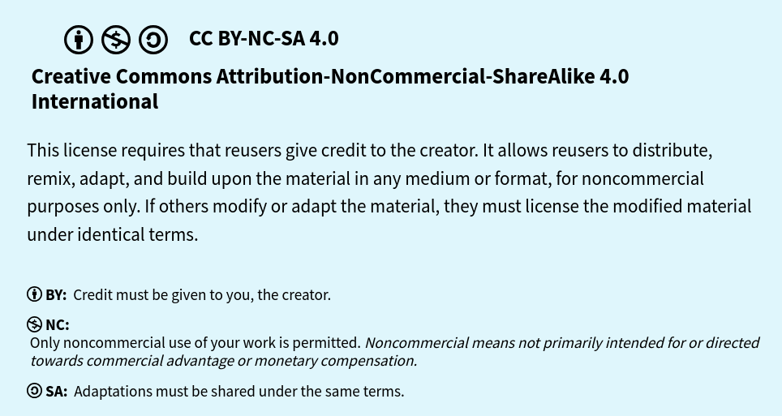

# License

Este trabajo está bajo la licencia **Creative Commons Attribution-NonCommercial-ShareAlike 4.0 International License (CC BY-NC-SA 4.0)**.

Copyright (c) 2026

## Eres libre de:

- **Compartir** — copiar y redistribuir el material en cualquier medio o formato.
- **Adaptar** — remezclar, transformar y construir a partir del material.

## Bajo las siguientes condiciones:

- **Attribution (BY)** — Debes otorgar el crédito correspondiente, proporcionar un enlace a la licencia e indicar si se han realizado cambios. Puedes hacerlo de cualquier manera razonable, pero no de forma que sugiera que el licenciante respalda tu uso o a ti.

- **NonCommercial (NC)** — No puedes utilizar el material con fines comerciales.

- **ShareAlike (SA)** — Si remezclas, transformas o creas a partir del material, debes distribuir tus aportaciones bajo la misma licencia que la original.

## Texto completo de la licencia
Para consultar el texto legal completo de la licencia, visita:

https://creativecommons.org/licenses/by-nc-sa/4.0/