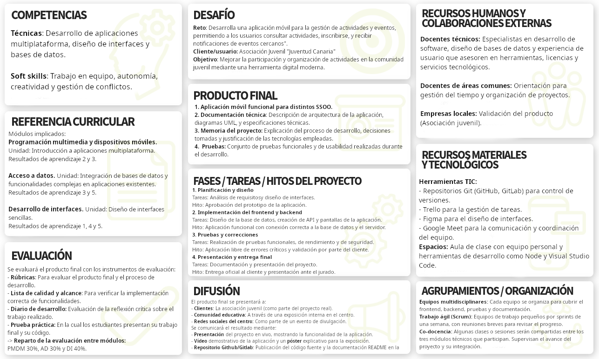
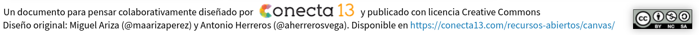

# UNIDAD 2. Metodologías y diseño de un reto o proyecto intermodular

## Boceto del reto

En esta imagen se plantea el diseño de un reto para el segundo curso del ciclo de Grado Superior de Desarrollo de Aplicaciones Multiplataforma (2DAM).

## Diseño original sin rellenar

## Guía (enunciado) de realización de la actividad
01. Competencias (técnicas y transversales): 
    ¿Qué competencias profesionales del ciclo se desarrollan?
    ¿Qué soft skills se entrenan (comunicación, trabajo en equipo, autonomía, etc.)?

02. Referencia curricular: 
    Selecciona resultados de aprendizaje y criterios de evaluación de los módulos implicados.
    Indica a qué unidades/RA se vincula el proyecto de los módulos participantes.

03. Desafío (reto/pregunta guía): 
    Formula un reto claro y contextualizado: una necesidad, problema o encargo profesional.
    Incluye el “para quién” (cliente/usuario/empresa/centro/entidad).

04. Producto final: 
    Define qué se entregará al final (artefacto, servicio, prototipo, informe, campaña, instalación, etc.).
    Añade evidencias asociadas: documentación técnica, memoria, presentación, pruebas, etc.

05. Fases / tareas / hitos: 
    Esboza las 4–6 fases a seguir a lo largo del proyecto.

06. Recursos humanos y colaboraciones externas: 
    ¿Qué perfiles participan (docentes, otros departamentos, orientación, empresas, ayuntamiento, asociaciones…)?
    ¿Qué aportará cada colaboración (briefing, mentoría, visita, validación, datos, material…)?

07. Recursos materiales y tecnológicos: 
    Espacios y equipamiento necesarios (taller, aula, laboratorio, software, maquinaria…).
    Herramientas TIC (apps, simuladores, LMS, IA, repositorios, tableros kanban, etc.).

08. Agrupamientos / organización: 
    ¿Cómo se organizará el alumnado (equipos, roles, rotaciones, scrum, parejas…)?
    ¿Cómo se coordinarán los módulos (sesiones conjuntas, entregas por módulo, co-docencia)?

09. Evaluación: 
    ¿Qué se evaluará y con qué instrumentos (rúbrica, lista de cotejo, diario, prueba práctica, defensa oral…)?
    ¿Cómo se reparte la evaluación entre módulos? (ponderaciones o evidencias por módulo).

10. Difusión: 
    ¿A quién se presentará el producto final (centro, empresas, comunidad, ferias, web del ciclo…)?
    ¿Cómo se comunicará el resultado (demo day, póster, vídeo, repositorio, exposición…)?

[<- Volver al portfolio](../../README.md)
